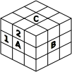
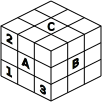
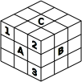

# How to solve a Rubik's Cube

#### 1. Swap edge pieces

A-1 C-1 B-1 A-1 B A C

#### 2. Flip edge pieces

[A-1 C-1 B-1 A-1 B A C]2

#### 3. Move corner pieces

(A C A-1 C-1)3 (B-1 A-1 B A)3

#### 4. Twist corner pieces

[(A-1 C A C-1) (C-1 B C B-1) (B-1 A B A-1)]2

#### References
Havlík R., *Straší vás kostka?*, 1981, *ABC* magazine, volume 26, issue 7, pages 10-11

Zalgaller V., Zalgaller S., *Vengerskij sharnirnyj kubik*, 1980, *Kvant* magazine, issue 12, pages 17-21 [http://kvant.mccme.ru/1980/12/vengerskij_sharnirnyj_kubik.htm](http://kvant.mccme.ru/1980/12/vengerskij_sharnirnyj_kubik.htm)
